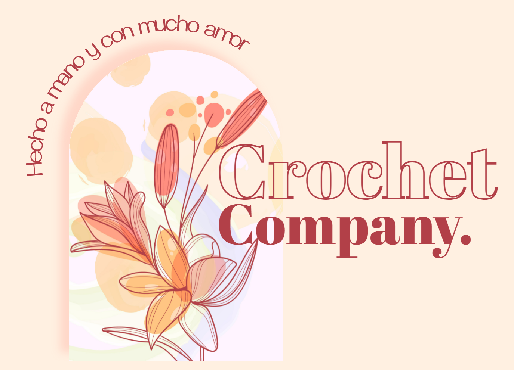
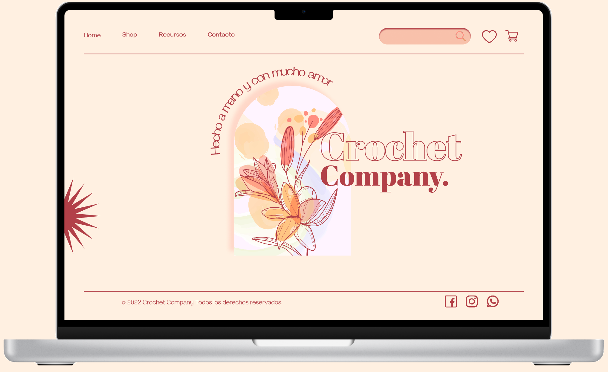
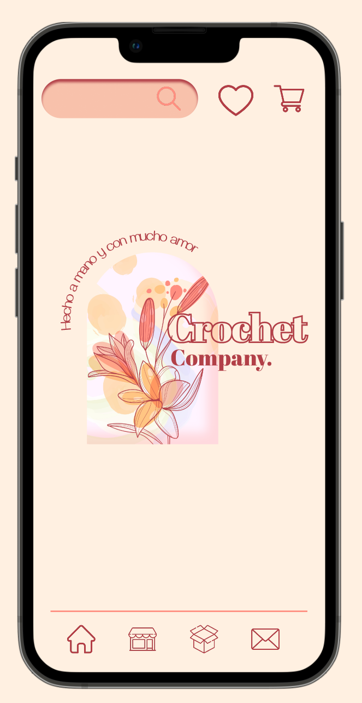
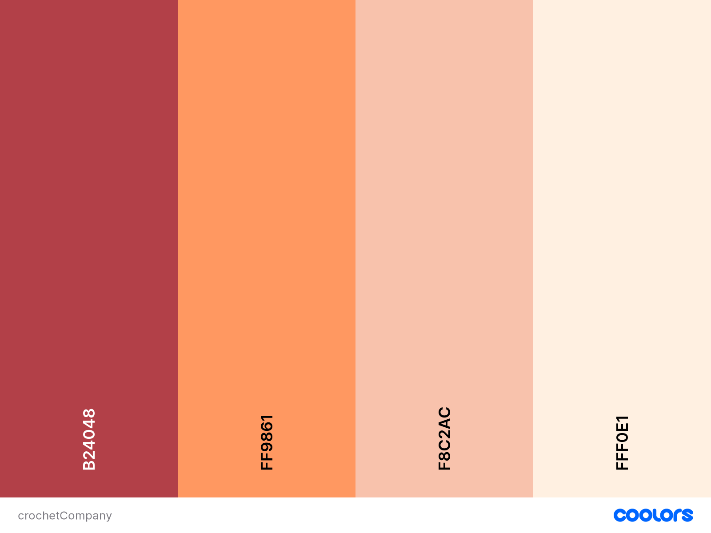

<div align="center">

  
  
  
  https://crochetcompany.netlify.app/
  
  
  </div>

<br />

<!-- Table of Contents -->
# 💻 Table of Contents

- [About the Project](#star2-about-the-project)
  * [Screenshots](#camera-screenshots)
  * [Tech Stack](#space_invader-tech-stack)
  * [Features](#dart-features)
  * [Color Reference](#art-color-reference)
- [Getting Started](#toolbox-getting-started)
  * [Installation](#gear-installation)
  * [Run Locally](#running-run-locally)
- [Author](#wave-contributing)
- [Contact](#contact)

  

<!-- About the Project -->
## ⭐ About the Project
La idea del proyecto surge de mi hobby por el tejido en crochet, me pareció interesante poder crear un e-commerce para su comercialización.

Presentación del proyecto -> https://www.canva.com/design/DAFGFqrxfrE/azfFyrenlhYPa4K-WbagFg/view?utm_content=DAFGFqrxfrE&utm_campaign=designshare&utm_medium=link&utm_source=publishpresent

<!-- Screenshots -->
### 📷 Screenshots

<div align="center"> 
  
  <br>
  
</div>


<!-- TechStack -->
### 👾 Tech Stack

- ReactJs (18.2.0)
- CSS 

<!-- Features -->
### 🎯 Features

- Consumo de datos desde una API, utilizando Sheetsu
- Barra de Búsqueda live
- Opción de favoritos
- Suma de productos al carrito
- Vaciado total del carrito
- Contacto via Whatsapp
- Diseño responsive

<!-- Color Reference -->
### 🎨 Color Reference





<!-- Getting Started -->
## 	🧰 Getting Started

<!-- Run Locally -->
### 🏃‍♀️ Run Locally

Clona el proyecto

```bash
  git clone https://github.com/mflamanna/CrochetCompany.git
```
Instala las dependencias

```bash
  npm i
```

Abre en el navegador

```bash
  npm start
```

<!-- Contributing -->
## 👋 Contributing

Sugerencias y contribuciones son siempre bienvenidas!

Mira en el apartado de contacto para más información.


<!-- Contact -->
## 🤝 Contact

Florencia Lamanna - lamanna.mflorencia@gmail.com

Project Link: [https://github.com/mflamanna/CrochetCompany.git]